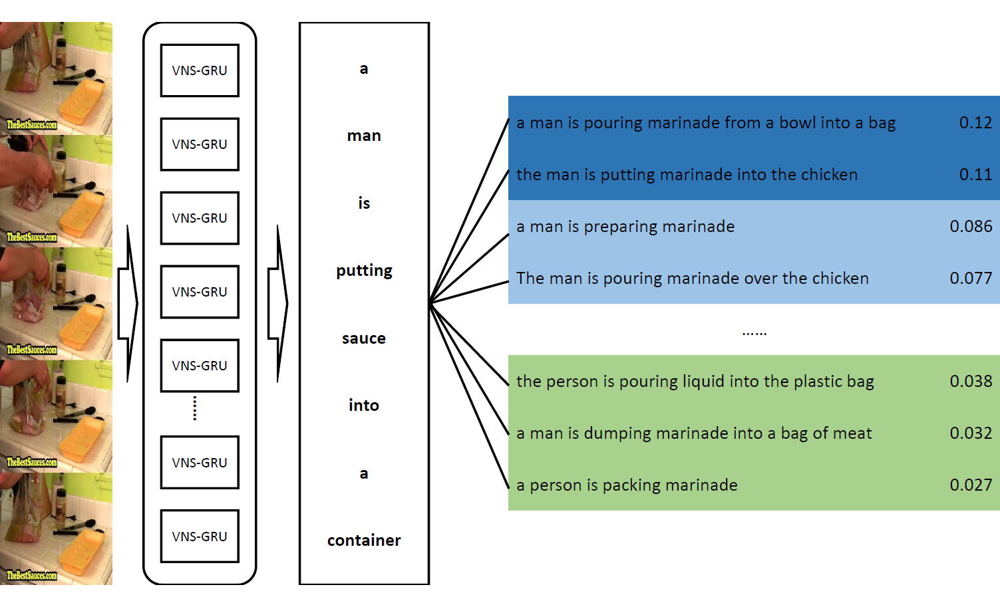

# Delving Deeper into the Decoder for Video Captioning
[](http://makeapullrequest.com) 


## Table of Contents
1. [Description](#description)
2. [Requirement](#requirement)
3. [Manual](#manual)
4. [Results](#results)
    1. [Comparison on Youtube2Text](#cy)
    2. [Comparison on MSR-VTT](#cm)
5. [Data](#data)
6. [Citation](#citation)

## <a name="description"></a> Description
This repository is the source code for the paper named [***Delving Deeper into the Decoder for Video Captioning***](https://arxiv.org/abs/2001.05614).  
The paper has been accepted by [***ECAI 2020***](http://ecai2020.eu/). The encoder-decoder framework is the most popular paradigm for video captioning task. There still exist some non-negligible problems in the decoder of a video captioning model. We propose three methods to improve the performance of the model.
1. A combination of variational dropout and layer normalization is embeded into semantic compositional gated recurrent unit to alleviate the problem of overfitting. 
2. A unified, flexible method is proposed to evaluate the model performance on a validation set so as to select the best checkpoint for testing. 
3. A new training strategy called professional learning is proposed which develops the strong points of a captioning model and bypasses its weaknesses.

It is demonstrated in the experiments of MSVD and MSR-VTT datasets that our model has achieved the best results evaluated by BLEU, CIDEr, METEOR and ROUGE-L metrics with significant gains of up to 11.7% on MSVD and 5% on MSR-VTT compared with the previous state-of-the-art models.

---


---

## <a name="requirement"></a>Requirement
1. Python 3.6
2. TensorFlow-GPU 1.13
3. pycocoevalcap (Python3)
4. NumPy

## <a name="manual"></a>Manual
1. Make sure you have installed all the required packages.
2. Download files in the [Data section](#data).
3. `cd path_to_directory_of_model; mkdir saves`
4. `run_model.sh` is used for training or testing models.
 Specify the GPU you want to use by modifying `CUDA_VISIBLE_DEVICES` value. `name` will be used in the name of saved model during training. Specify the needed data paths by modifying `corpus`, `ecores`, `tag` and `ref` values. `test` refers to the path of the saved model which is to be tested. Do not give a parameter to `test` if you want to train a model.
5. After completing the configuration of the bash file, then `bash run_model.sh` for training or testing.

---
## <a name="results"></a> Results

### <a name="cy"></a> Comparison on Youtube2Text

| Model   | B-4      | C        | M        | R        |  Overall |
| :------ | :------: | :------: | :------: | :------: | :------: |
|SCN      | 51.1     | 77.7     | 33.5     | -        | -        |
|MTVC     | 54.5     | 92.4     | 36.0     | 72.8     | 0.862    |
|CIDEnt-RL| 54.4     | 88.6     | 34.9     | 72.2     | 0.844    |
|HATT     | 52.9     | 73.8     | 33.8     | -        | -        |
|ECO      | 53.5     | 85.8     | 35.0     | -        | -        |
|GRU-EVE  | 47.9     | 78.1     | 35.0     | 71.5     | 0.795    |
|MARN     | 48.6     | 92.2     | 35.1     | 71.9     | 0.830    |
|SAM-SS   | 61.8     |103.0     | 37.8     | 76.8     | 0.936    |
|VNS-GRU  | **64.9** |**115.0** |**41.1**  |**78.5**  | **1.000**|

### <a name="cm"></a> Comparison on MSR-VTT

| Model       | B-4      | C        | M        | R        |  Overall |
| :------     | :------: | :------: | :------: | :------: | :------: |
|v2t_navigator| 40.8     | 44.8     | 28.2     | 60.9     | 0.917    |
|Aalto        | 39.8     | 45.7     | 26.9     | 59.8     | 0.900    |
|VideoLAB     | 39.1     | 44.1     | 27.7     | 60.6     | 0.899    |
|CIDEnt-RL    | 40.5     | 51.7     | 28.4     | 61.4     | 0.952    |
|HACA         | 43.4     | 49.7     | **29.5** | 61.8     | 0.969    |
|HATT         | 41.2     | 44.7     | 28.5     | 60.7     | 0.920    |
|GRU-EVE      | 38.2     | 48.1     | 28.4     | 60.7     | 0.919    |
|MARN         | 40.4     | 47.1     | 28.1     | 60.7     | 0.924    |
|TAMoE        | 42.2     | 48.9     | 29.4     | 62.0     | 0.958    |
|SAM-SS       | 43.8     | 51.4     | 28.9     | 62.4     | 0.977    |
|VNS-GRU      | **46.0** | **52.0** | **29.5** | **63.3** | **1.000**|


---
## <a name="data"></a> Data

### <a name="dmsvd"></a> MSVD
- MSVD reference file: [Link](https://cloud.tsinghua.edu.cn/f/8425bb76757f49699e26/?dl=1)
    * SHA-256 759bbe3eb3060f7a4636c9e15194019f228072bbe3ebd91185fc3cfe2352e9da
- MSVD ResNeXt ECO file: [Link](https://cloud.tsinghua.edu.cn/f/4b5b49f37f4c48818488/?dl=1)
    * This is the video-level feature extracted by 
    [ResNeXt101c64](https://github.com/taehoonlee/tensornets) and 
    [Efficient Convolutional Network](https://github.com/mzolfaghari/ECO-efficient-video-understanding).
    * SHA-256 6b991bcad4f869d21cff03e2a90948a05ac7969db714fd950e94cf9027b6ae49
- MSVD Semantic tag file: [Link](https://cloud.tsinghua.edu.cn/f/6da301d86822407995a3/?dl=1)
    * SHA-256 cdfd487bd86bd85532f2e48e8182fbf9793fc430e61fbc13fb390f50232df718
- MSVD Corpus file: [Link](https://cloud.tsinghua.edu.cn/f/035ce798d9d74d28a91c/?dl=1)
    * SHA-256 fc8ff62d528d71a6aee9800bcb89552e1c2fbc1ac7516dd6f6fcdd20f76876d1
- Model Checkpoint: [Compressed File](https://cloud.tsinghua.edu.cn/f/a22811befd8a47668a58/?dl=1)
    * SHA-256 6d0c5434d56bcbd4689d58bdce5f0270a40d69921f1b97e6bba30deb848f97fb

### <a name="dmsrvtt"></a> MSRVTT
- MSRVTT reference file: [Link](https://cloud.tsinghua.edu.cn/f/e814ef0de54549d0a1d8/?dl=1)
    * SHA-256 6434e06c442170dec276c7729b685dc42c3a265b7fb0b7cd217bfbb9b54218f5
- MSRVTT ResNeXt ECO file: [Link](https://cloud.tsinghua.edu.cn/f/f69701c47f6d4a43a8ca/?dl=1)
    * This is the video-level feature extracted by 
    [ResNeXt101c64](https://github.com/taehoonlee/tensornets) and 
    [Efficient Convolutional Network](https://github.com/mzolfaghari/ECO-efficient-video-understanding).
    * SHA-256 4f065d96b8e8abbafa4b650504221c0352fba19da84e5dac43a6f9e343421da2
- MSRVTT Semantic tag file: [Link](https://cloud.tsinghua.edu.cn/f/1800b13c1d694abdb225/?dl=1)
    * SHA-256 22df06b2a33ee93992542482e743764f8ea57312c7c5d2f7c8c0b76cb23fae4a
- MSRVTT Corpus file: [Link](https://cloud.tsinghua.edu.cn/f/58eb6326f0d64ad1b577/?dl=1)
    * SHA-256 d9fcd6c6e54e22bb992893575a0e829ec23c1edca3757f04d7d40e89d62e8d64
- Model Checkpoint: [Compressed File](https://cloud.tsinghua.edu.cn/f/eb4f4103495640228b95/?dl=1)
    * SHA-256 1a424c3aaa027785a07b675ba3a208055661c867fb86070c5ea837c78e2311f2

---

### <a name="citation"></a> Citation
```
@article{chen2020delving,
	title={Delving Deeper into the Decoder for Video Captioning},
	author={Haoran Chen and Jianmin Li and Xiaolin Hu},
	journal={CoRR},
    archivePrefix={arXiv},
	primaryClass={cs.CV},
	url={https://arxiv.org/abs/2001.05614},
	eprint={2001.05614},
	year={2020}
}
```